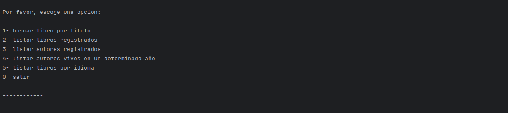
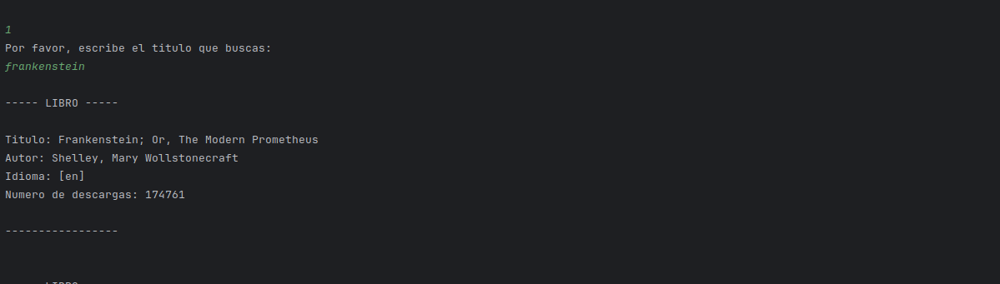
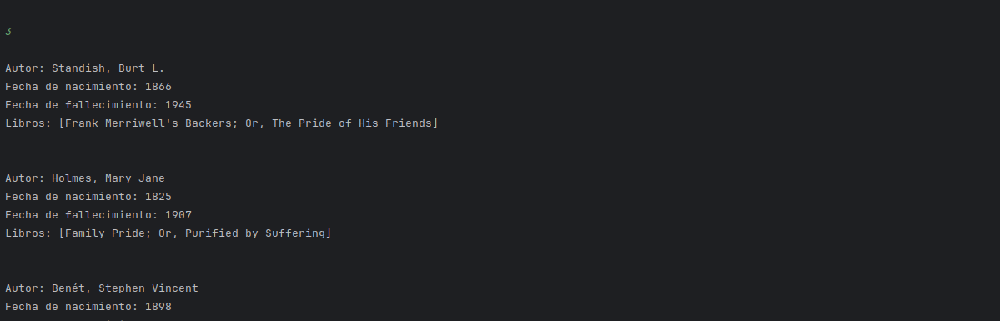
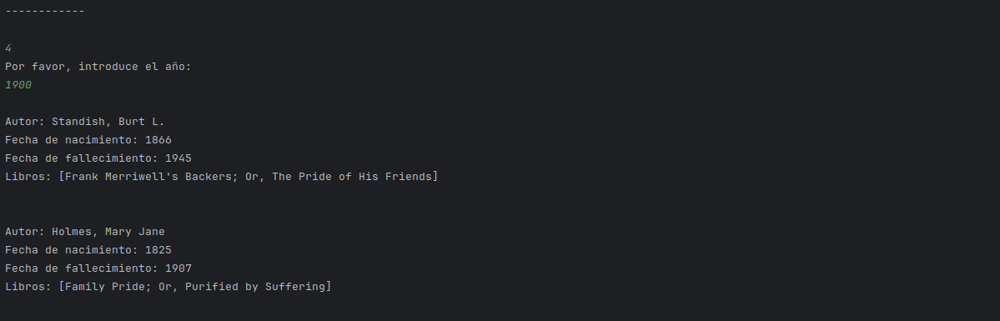
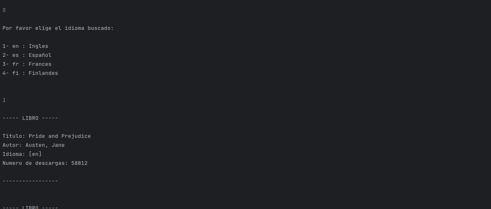

# Proyecto LITERALURA

---

### Proyecto que forma parte del programa ONE - ORACLE NEXT Education

<div align="center">


</div>

---

### Objetivos:

Desarrollar un Catálogo de Libros que ofrezca interacción textual (vía consola) con los usuarios, proporcionando al menos 5 opciones de interacción. Los libros se buscarán a través de una API específica.

### Tecnologias utilizadas:


##### Dependencia utilizadas:
```
<dependency>
    <groupId>com.fasterxml.jackson.core</groupId>
    <artifactId>jackson-databind</artifactId>
    <version>2.18.1</version>
</dependency>
<dependency>
    <groupId>org.springframework.boot</groupId>
    <artifactId>spring-boot-starter-data-jpa</artifactId>
</dependency>
<dependency>
    <groupId>org.postgresql</groupId>
    <artifactId>postgresql</artifactId>
    <scope>runtime</scope>
</dependency>
```
---

## Funcionalidades

#### Menu principal



Al buscar por titulo consultamos a la API, y si el titulo y el autor no existen, agregamos el autor a la BD y el titulo, y mostramos los datos de los libros encontrados por pantalla.



Tambien podemos listar los libros registrados directamente en la BD y mostrarlos de la misma manera.


Otra funcion es listar los autores registrados con sus libros:



Si elegimos la opcion buscar autores vivos en un determinado año nos preguntara que año buscamos y nos mostrara la lista de los autores registrados en la BD:



Y en la opcion de idiomas podemos buscar los libros en el idioma de la lista:


